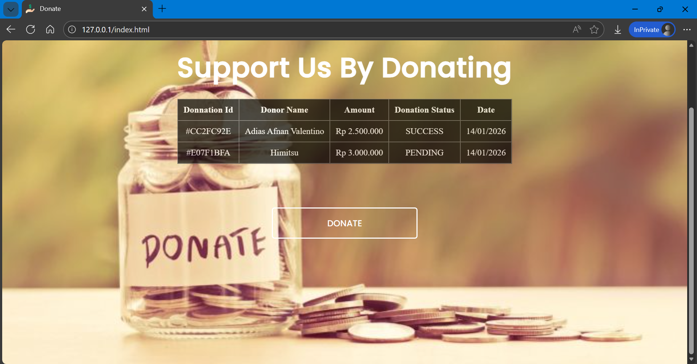

# Spring Payment Gateway Integration

A web-based payment system built with **Spring Boot** that demonstrates the integration of a third-party payment gateway (**Xendit**) to handle online transactions.  
This project focuses on clean architecture, backend integration, webhook handling, caching, and containerized deployment rather than UI complexity.

---

## Table of Contents
- Overview
- System Scope
- Architecture Overview
- Technology Stack
- Payment Gateway Integration
- Webhook Handling
- Redis Usage
- Docker Support
- API Documentation
- Screenshots
- Project Status
- Repository

---

## Overview
Spring Payment Gateway Integration is a sample implementation of an online payment system using **Spring Boot**.  
The application exposes backend services to create and manage payment transactions, process asynchronous payment notifications, and generate transaction results once a payment is completed.

The frontend is intentionally kept simple to emphasize backend integration, payment flow, and system reliability.

---

## System Scope
This project covers:
- Backend payment processing using Spring Boot
- Integration with an external payment provider (Xendit)
- Asynchronous webhook handling
- Temporary data storage and caching with Redis
- Containerized deployment using Docker

---

## Architecture Overview
The system follows a layered architecture:

- **Controller Layer**  
  Handles HTTP requests from the frontend and external services (webhooks).

- **Service Layer**  
  Contains business logic related to payment creation, validation, and status handling.

- **Persistence Layer**  
  Manages transaction and invoice data storage.

---

## Technology Stack

### Backend
- Java
- Spring Boot
- Spring Web
- Redis
- Xendit 

### Frontend
- HTML5
- CSS3
- JavaScript
- jQuery

### Infrastructure
- Docker
- Docker Compose

---

## Payment Gateway Integration
Xendit is used as the external payment gateway to:
- Create payment invoices
- Support multiple payment methods
- Handle transaction lifecycle management
- Provide asynchronous payment notifications

Supported payment methods include:
- ShopeePay
- BNI Virtual Account

---

## Webhook Handling
The application exposes webhook endpoints to receive payment status updates from Xendit.

Webhook processing includes:
- Payload validation
- Transaction status updates
- Triggering invoice generation

This ensures accurate payment state synchronization between the system and the payment provider.

---

## Redis Usage
Redis is integrated to improve system performance and reliability by:
- Caching transaction states
- Managing temporary payment sessions
- Handling webhook idempotency
- Reducing unnecessary database queries

---

## Docker Support
Docker is used to simplify local development and deployment.

Containerized services include:
- Spring Boot application
- Web Payment Gateway
- Redis server
- Ngrok

Docker Compose is provided to orchestrate all required services with minimal configuration.

---

## API Documentation
API endpoints are documented using Postman.

🔗 **Postman Collection**  
https://www.postman.com/your-postman-link-here

> Replace the link above with the actual Postman collection URL.

---

## Screenshots

### Homepage

### Payment Page

### Payment Success

---

## Project Status
**Completed**  
This project is intended for learning, demonstration, and technical assessment purposes.

---

## Repository
🔗 **GitHub Repository**  
https://github.com/your-username/spring-payment-gateway

> Replace the link above with the actual GitHub repository.

---

## Notes
This project is suitable as:
- A backend-focused portfolio project